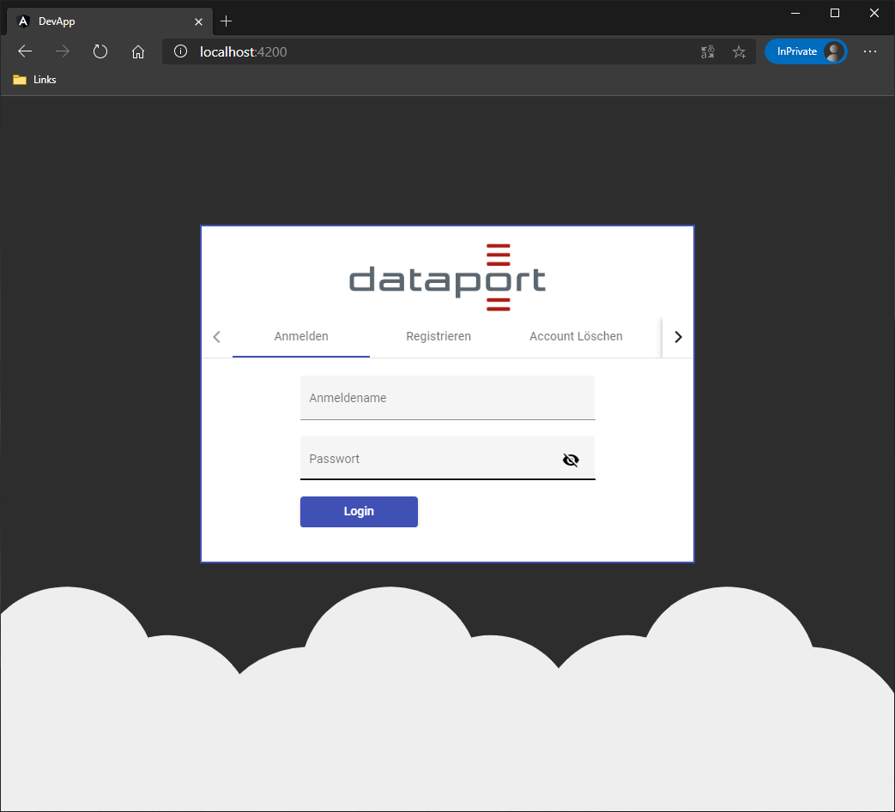
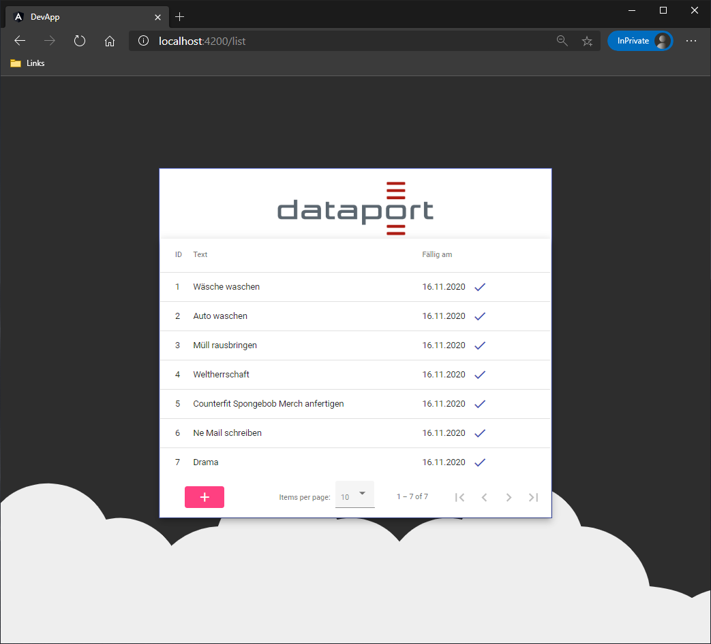

# Dataport Azubi "Todo-Liste" Lernprojekt

[](https://www.dataport.de/)

#### * Das Projekt dient rein als Programmierübung und entspricht nicht den Dataport Standard / Richtlinien.

# Projektbeschhreibung
Eine "TODO-Liste" welche mehrere Benutzer haben kann, welche alle eine eigene Liste haben.





# Gliederung
Das Projekt ist wie folgt gegliedert:

  - Assets (Bilder, etc.)
  - Backend (C# .NET Core Web API)
  - Frontend (Angular / TS mit Material Design)

# API
> createAccount: Erstellt einen Account.
```
Parameter:
user
pw
```

> authenticate: Meldet einen Account an.
```
Parameter:
user
pw
```

> deleteAccount: Löscht den aktuellen Account.
```
Parameter:
pw
```

> fetchList: Ruft alle "TODO's" vom Server ab.
```
Parameter:
changeset
```

> addToList: Fügt ein "TODO" dem Benutzer hinzu.
```
Parameter:
text
dueto
```

> removeFromList: Löscht ein "TODO" von dem Benutzer.
```
Parameter:
uid
```